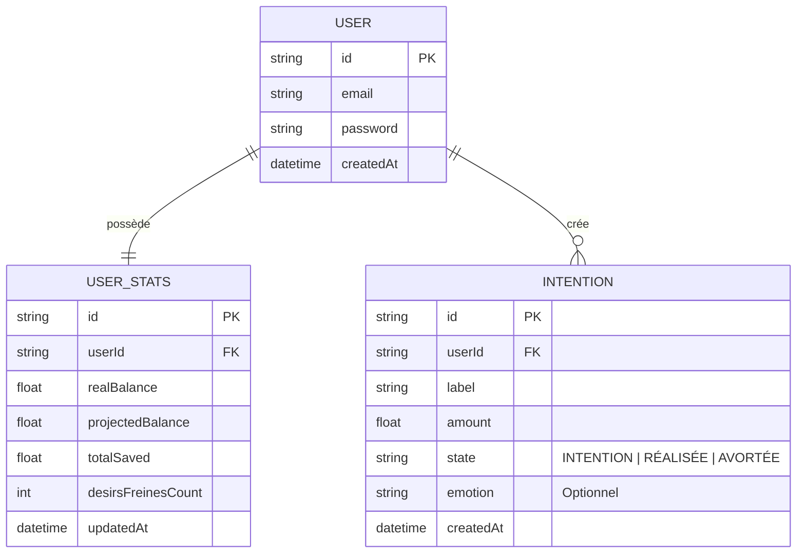

# 🧠 Spécifications Fonctionnelles & Logique Métier (BalanceMe)

Ce document détaille la traduction des besoins métier en règles de gestion techniques pour l'API BalanceMe.

## 1. Vision Métier : La "Conscience Financière"
L'objectif est de créer un **décalage temporel** entre l'impulsion d'achat et la dépense réelle. L'application agit comme un filtre cognitif.

| Concept | Traduction Métier |
| :--- | :--- |
| **L'Intention** | L'aveu d'une envie. On ne bloque pas l'utilisateur, on lui montre les conséquences. |
| **La Victoire** | Le renoncement volontaire. L'argent "économisé" devient une valeur positive (fierté). |
| **Le Réel** | La réalité bancaire. Ce qui est déjà parti. |

---

## 2. Logique de Calcul des Soldes (Le Cœur du Système)
C'est ici que se joue la valeur ajoutée du projet. Nous gérons trois compteurs distincts :

### A. Le Solde Réel (`realBalance`)
* **Définition** : L'argent disponible sur le compte bancaire.
* **Règle de gestion** : Il ne diminue **que** lorsque l'intention passe au statut `REALISEE`. Tant que c'est une intention, l'argent est physiquement toujours là.

### B. Le Solde Projeté (`projectedBalance`)
* **Définition** : La vision pessimiste du futur ("Qu'est-ce qu'il me reste si je craque pour tout ?").
* **Règle de gestion** : Il diminue **immédiatement** dès qu'une `INTENTION` est créée.
* **Impact** : Si l'utilisateur renonce (`AVORTEE`), ce solde remonte (récupération du pouvoir d'achat).

### C. Les Victoires Intérieures (`totalSaved`)
* **Définition** : Le cumul des renoncements.
* **Règle de gestion** : Il augmente du montant de l'intention uniquement lors du passage au statut `AVORTEE`.

---

## 3. Modélisation de la Donnée (ERD)

Le schéma suivant représente l'organisation des tables et leurs relations (PostgreSQL/Supabase).

## 4. Matrice de Transition des États
Pourquoi utiliser un `Enum` ? Pour garantir l'intégrité de cet algorithme :
# 📊 Modélisation & Endpoints

### Table `Intention`
| Champ | Type | Description |
| :--- | :--- | :--- |
| `label` | String | Nom de l'article/envie |
| `amount` | Float | Prix de l'article |
| `status` | Enum | `INTENTION`, `REALISEE`, `AVORTEE` |
| `emotion` | String | Sentiment associé à l'envie |

### Table `UserStats`
| Champ | Type | Description |
| :--- | :--- | :--- |
| `realBalance` | Float | Argent réellement disponible |
| `projectedBalance` | Float | Solde si toutes les intentions sont achetées |
| `totalSaved` | Float | Cumul des économies via les intentions avortées |

---

## 📡 Points d'entrée (API REST)

| Méthode | Route | Description |
| :--- | :--- | :--- |
| `GET` | `/intentions` | Liste toutes les intentions d'achat |
| `POST` | `/intentions` | Crée une intention (impacte `projectedBalance`) |
| `PUT` | `/intentions/{id}/realize` | Marque comme réalisé (impacte `realBalance`) |
| `PUT` | `/intentions/{id}/abort` | Annule l'achat (incrémente `totalSaved`) |
| `GET` | `/intentions/stats` | Récupère le tableau de bord financier |

---

## 🔐 Configuration de Production
Le projet utilise des variables d'environnement sécurisées sur Render :
- **DATABASE_URL** : Connexion optimisée via le Pooler de Supabase (Port 6543).
- **DIRECT_URL** : Connexion directe pour les migrations Prisma (Port 5432).
- **PORT** : Injecté dynamiquement par l'hôte.
---

## 5. Choix Techniques Justifiés
* **UUID pour les IDs** : Sécurité accrue. On ne peut pas deviner l'ID d'une dépense en changeant juste un chiffre dans l'URL.
* **Prisma Enum** : Empêche l'injection de statuts fantaisistes qui casseraient les calculs de balance.
* **Table UserStats Unique** : Centralisation des compteurs pour éviter de recalculer des milliers de lignes de transactions à chaque appel du Dashboard (Optimisation des performances).
